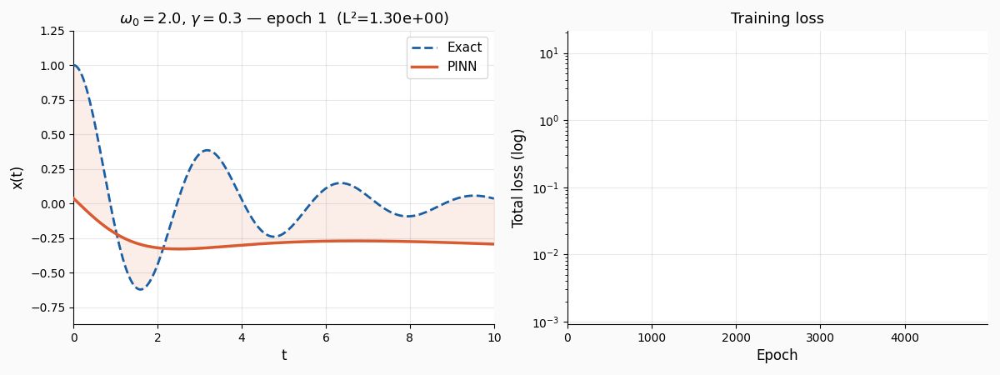
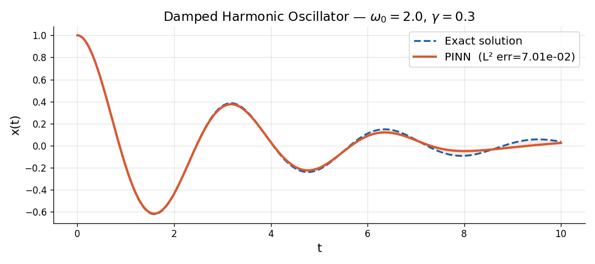
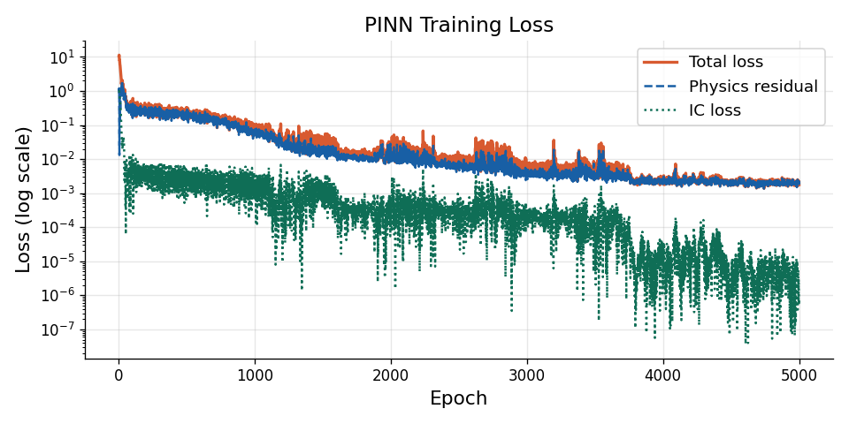

#  PINN — Oscillateur Harmonique Amorti

<p align="center">
  
</p>

<p align="center">
  <a href="https://pytorch.org"></a>
  <a href="https://www.python.org"></a>
  
  
</p>

---

## What is a PINN?

A **Physics-Informed Neural Network** (PINN) is a neural network that learns to satisfy a differential equation — not by fitting data, but by minimising a *physics residual* directly.

The network maps time → displacement:

```
t ──▶  [MLP]  ──▶  x̂(t)
```

and the loss has two terms:

| Term | Expression | Role |
|------|-----------|------|
| Physics residual | `x̂''(t) + 2γx̂'(t) + ω₀²x̂(t) = 0` | Enforce the ODE everywhere |
| Initial conditions | `x̂(0)=1`, `x̂'(0)=0` | Pin the boundary values |

Derivatives are computed with **PyTorch autograd** — no finite differences needed.

---

## The Equation

**Damped harmonic oscillator** (spring + viscous friction):

$$\ddot{x}(t) + 2\gamma\,\dot{x}(t) + \omega_0^2\,x(t) = 0, \quad x(0)=1,\;\dot{x}(0)=0$$

| Parameter | Symbol | Meaning |
|-----------|--------|---------|
| Natural frequency | `ω₀` | Spring stiffness |
| Damping coefficient | `γ` | Friction strength |
| Under-damped | `γ < ω₀` | Decaying oscillation |
| Critically damped | `γ = ω₀` | Fastest return to 0 |
| Over-damped | `γ > ω₀` | Slow exponential decay |

---

## Results

<table>
<tr>
<td></td>
<td></td>
</tr>
<tr>
<td align="center"><i>PINN prediction vs analytical solution</i></td>
<td align="center"><i>Loss components during training</i></td>
</tr>
</table>

---

## Project Structure

```
pinn_oscillator/
│
├── src/
│   ├── model.py      ← PINN architecture (MLP + Tanh)
│   ├── losses.py     ← ODE residual & IC loss (autograd)
│   ├── train.py      ← Training loop with Adam + LR scheduler
│   ├── utils.py      ← Exact solution, evaluation metrics
│   └── plot.py       ← Plotting + training GIF generator
│
├── tests/
│   └── test_pinn.py  ← Pytest unit tests
│
├── results/          ← Generated outputs (model, plots, GIF)
├── assets/           ← README assets (GIF, images)
├── main.py           ← CLI entry point
└── requirements.txt
```

---

## Quickstart

```bash
# 1. Clone
git clone https://github.com/YOUR_USERNAME/pinn_oscillator
cd pinn_oscillator

# 2. Install dependencies
pip install -r requirements.txt

# 3. Train (default: ω₀=2.0, γ=0.3, 5000 epochs)
python main.py

# 4. Custom parameters
python main.py --omega0 3.0 --gamma 0.5 --epochs 8000 --hidden 64
```

All outputs (plots, GIF, model checkpoint) are saved to `results/`.

---

## CLI Options

```
--omega0        Natural frequency ω₀          [default: 2.0]
--gamma         Damping coefficient γ          [default: 0.3]
--t_max         Time domain length             [default: 10.0]
--n_coll        Collocation points per epoch   [default: 200]
--hidden        Hidden units per layer         [default: 64]
--n_layers      Number of hidden layers        [default: 4]
--epochs        Training epochs                [default: 5000]
--lr            Initial learning rate          [default: 1e-3]
--lambda_ic     IC loss weight                 [default: 10.0]
--gif_snapshots GIF animation frames           [default: 60]
--save_dir      Output directory               [default: results]
```

---

## Architecture

```
Input: t ∈ ℝ
  │
  ▼
Linear(1 → H) + Tanh
  │
  ▼   × (n_layers - 1)
Linear(H → H) + Tanh
  │
  ▼
Linear(H → 1)
  │
  ▼
Output: x̂(t) ∈ ℝ
```

**Xavier initialisation** · **Adam optimiser** · **ReduceLROnPlateau** scheduler · **Gradient clipping** (max norm 1.0)

---

## Training Loss

$$\mathcal{L} = \underbrace{\frac{1}{N}\sum_{i=1}^N \left[\ddot{x}(t_i) + 2\gamma\dot{x}(t_i) + \omega_0^2 x(t_i)\right]^2}_{\text{physics residual}} + \lambda_{\text{IC}}\underbrace{\left[(x(0)-1)^2 + (\dot{x}(0))^2\right]}_{\text{initial conditions}}$$

---

## Run Tests

```bash
pytest tests/ -v
```

---

## References

- Raissi, M., Perdikaris, P., Maziar, R., & Karniadakis, G. E. (2019). [Physics-informed neural networks: A deep learning framework for solving forward and inverse problems involving nonlinear PDEs](https://www.sciencedirect.com/science/article/pii/S0021999118307125). *Journal of Computational Physics*, 378, 686–707.
- Lagaris, I. E., Likas, A., & Fotiadis, D. I. (1998). [Artificial neural networks for solving ordinary and partial differential equations](https://ieeexplore.ieee.org/document/712178). *IEEE Transactions on Neural Networks*.

---

## License

MIT © 2025
